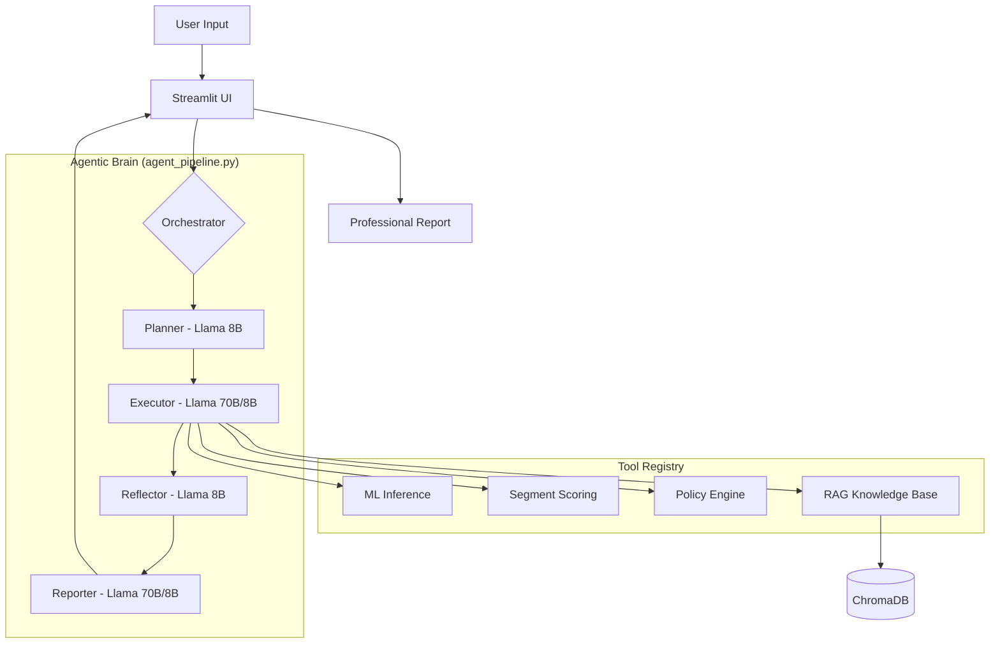
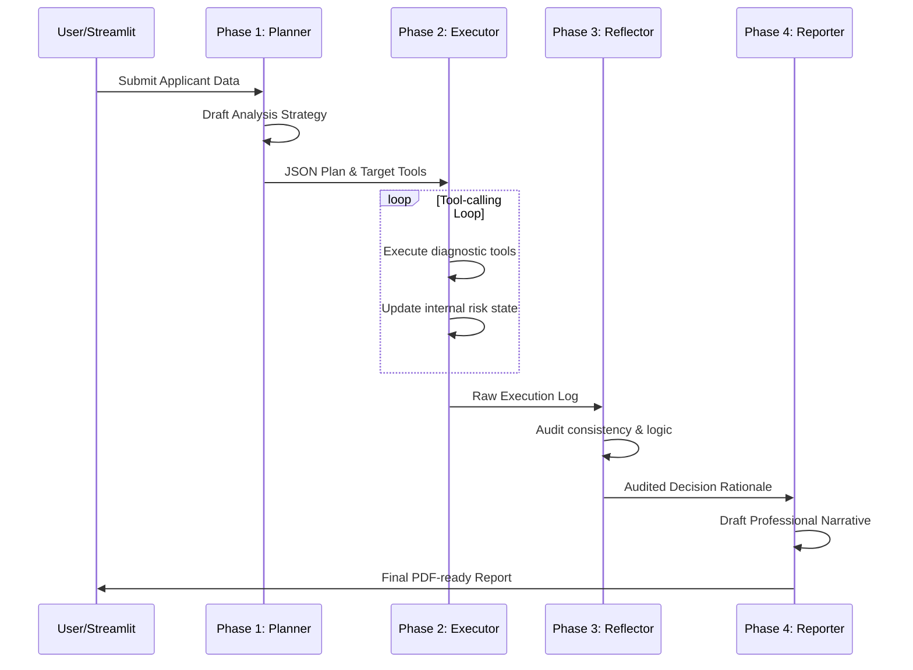
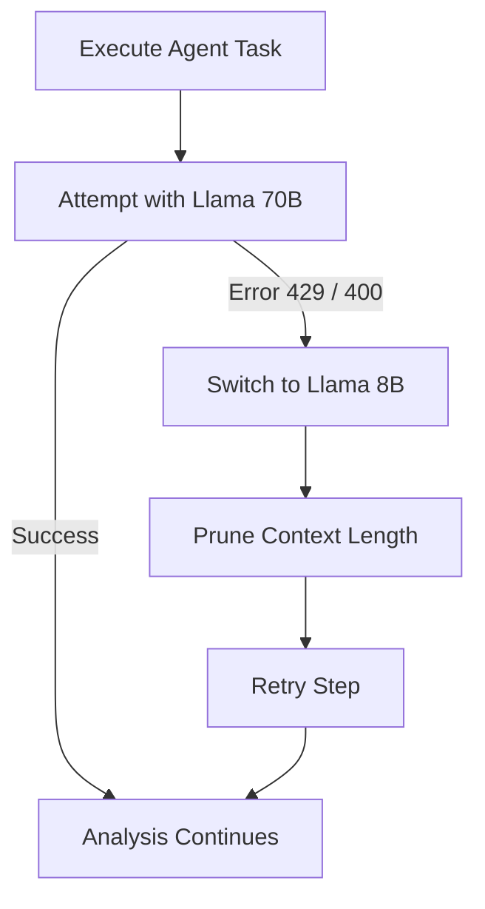

# CreditIQ — Agentic Risk Intelligence Platform

> **Quick Links**: [Intuitive Workflow](#🧠-intuitive-workflow-overview) | [Technical Architecture](#🏗-system-architecture) | [Detailed File Map](file:///Users/kshtriyatinsingh/Desktop/CreditIQ/cleaned.md)

**CreditIQ** is an advanced decision-making engine that uses AI to analyze loan applications. Unlike traditional systems that just give a "Yes" or "No," CreditIQ follows a deep reasoning process—much like a senior credit committee—to justify its decisions with data, policy, and logic.

---

## 🧠 Intuitive Workflow Overview: The "Expert Committee"

To understand how CreditIQ processes a loan without diving into the code, imagine a **three-tier expert committee** working in sync:

1.  **Phase 1: The Strategist (The Planner)**  
    Instead of jumping straight into the data, the AI starts by acting as a **Lead Underwriter**. It reviews the applicant's basic profile and decides on a strategy. Just like a human expert, it asks: *"What specific risks do I need to investigate for this person? Do I need to look deeper into their medical loan intent or their historical defaults?"* It produces a tailored roadmap for the rest of the system to follow.

2.  **Phase 2: The Investigator (The Executor)**  
    This is the "worker" phase. Guided by the Strategist's roadmap, the system reaches into its **Tool Registry**. It calculates the machine learning risk score, benchmarks the applicant against their peers (Income vs. Loan), and scans the corporate credit policy. It gathers every piece of evidence needed to make an informed decision.

3.  **Phase 3: The Independent Auditor (The Reflector)**  
    This is what makes CreditIQ **"Agentic."** A separate logic layer reviews the Investigator's work. It doesn't just trust the results; it audits them for consistency. If the Auditor finds that a crucial piece of policy was ignored or a calculation seems fishy, it triggers a **self-correction loop**, forcing the Investigator to go back and fix the mistake. This ensures the final decision is logically sound and auditable.

4.  **Phase 4: The Professional Communicator (The Reporter)**  
    Calculations and JSON data aren't useful for a bank manager. This final phase takes the complex audit trail and translates it into a **professional narrative report**. It explains the "Why" behind the "Yes" or "No," citing specific policy clauses and risk factors, so a human can verify the decision in seconds.

---

## 🏗 System Architecture

The following diagram illustrates the relationship between the Streamlit interface, the Agentic Orchestrator, and the specialized tool ecosystem.

---

## 🚀 Key Features

- **Dual-Mode Analysis**: Choose between "Lightning Prediction" (pure ML speed) and "Deep AI Analysis" (full agentic reasoning).
- **PER Framework**: A multi-agent orchestrator that **Plans**, **Executes**, **Reflects**, and **Reports**.
- **RAG-Powered Policy**: Integrated **ChromaDB** for real-time semantic search over credit rulebooks.
- **Ultra-Economy Resilience**: Automatic fallback logic that ensures analysis completion even during API rate limits.
- **Soft & Secure Reporting**: Financial-grade narrative generation with prompt-injection guardrails and jargon filtering.

---

## 🧠 The PER Pipeline Workflow

The Agentic Brain operates in four distinct phases to ensure transparency and logical consistency.

---

## 🛡 Ultra-Economy Resilience

To handle restrictive Groq API rate limits (429 errors), CreditIQ implements a multi-layer resiliency strategy.

| Feature | Description |
| :--- | :--- |
| **Hybrid Fallback** | Automatically switches from the large model to the small model if limits are reached. |
| **Context Pruning** | Intelligently removes old conversation history during the loop to keep token usage low. |
| **Multi-Model Routing** | Uses the cheaper 8B model for simple tasks (Planning/Auditing) to save "tokens per day." |

---

## 🛠 Tool Ecosystem

The Agent controls a specialized **Tool Registry** to perform deep diagnostics:

| Tool Name | Output | Role in Analysis |
| :--- | :--- | :--- |
| `preprocess_and_predict` | Decision, Prob, State | Core Machine Learning inference using a trained Decision Tree. |
| `score_applicant_segment` | Benchmarks, Score | Peer calculations (Income percentiles, DTI ratios). |
| `compute_risk_flags` | List of Flags, Severity | Hard-coded policy logic (e.g., minimum income or history). |
| `retrieve_credit_rules` | Semantic Policy Snippets | RAG-based search for relevant clauses from the credit policy. |
| `build_decision_rationale` | Structured JSON | Final summary that unites ML data with Qualitative policy findings. |

---

## 📁 Project Structure

- `app.py`: Streamlit frontend, state management, and plotting logic.
- `agent_pipeline.py`: The "Brain" of the system. Contains the PER logic, tool registry, and RAG configuration.
- `dt_model.pkl`: The current production ML model and preprocessing artifact.
- `requirements.txt`: Environment dependencies.
- `.streamlit/secrets.toml`: Local storage for the `GROQ_API_KEY`.

---

## ⚙️ Setup & Configuration

1. **Install Dependencies**: `pip install -r requirements.txt`
2. **Setup Secrets**: Add your key to `.streamlit/secrets.toml`.
3. **Run App**: `streamlit run app.py`

---
