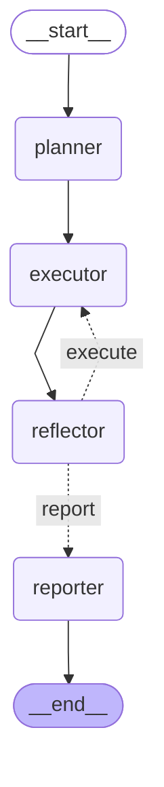

# CreditIQ Agent Logic Flow

This diagram illustrates the **LangGraph State Machine** that powers the CreditIQ "Brain." Instead of a simple top-to-bottom script, this is a dynamic graph where the AI can "think," "investigate," and "self-correct."

### The Logic Path:
- **`START` → `planner`**: The AI acts as a **Lead Underwriter**, mapping out which risk tools to use based on the applicant's profile.
- **`planner` → `executor`**: The "workhorse" phase. The AI calls its tools (ML, Policy, RAG) to gather data.
- **`executor` → `reflector`**: The **Audit** phase. An independent logic layer checks if the executor missed anything or made a mistake.
- **`reflector` (Loop) → `executor`**: If the Auditor finds a gap, it triggers a **self-correction cycle**, forcing the investigator to try again.
- **`reflector` → `reporter`**: Once the logic is airtight, the AI drafts the final narrative report.
- **`reporter` → `END`**: The decision is finalized and delivered to the UI.

---

